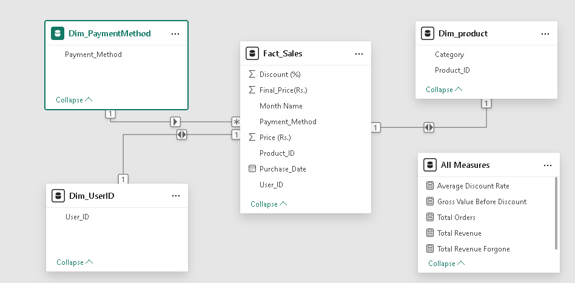
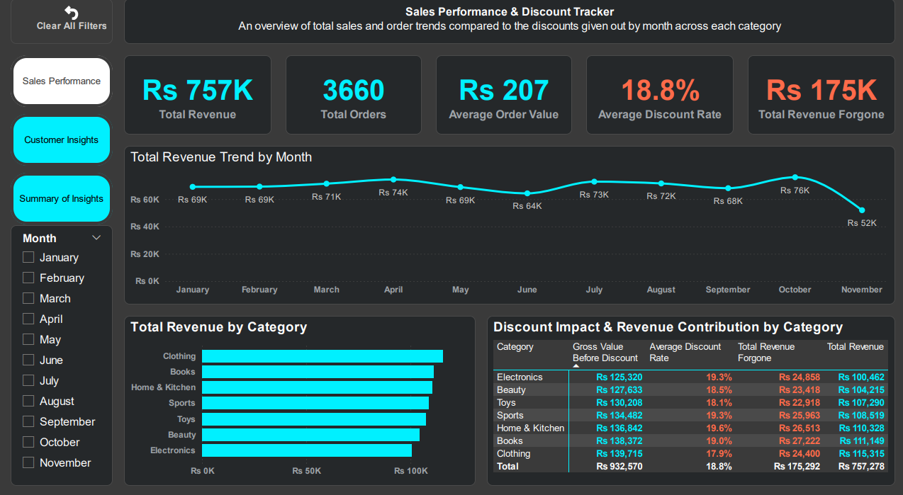
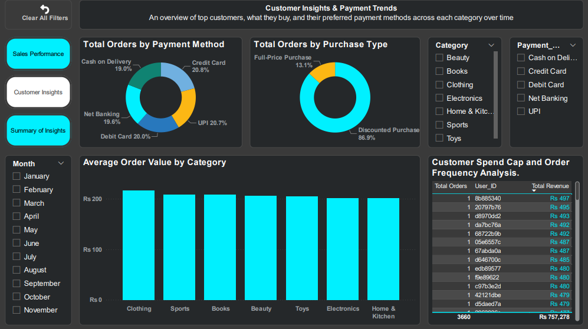

# E-Commerce Sales Performance & Discount Optimization

## Project Overview
This project showcases a full end-to-end Power BI analytics solution designed to evaluate e-commerce sales performance, payment behavior, discount effectiveness, and customer purchasing trends. The objective was to transform a transactional dataset into an interactive business dashboard that supports smarter, data-driven decision-making.

By combining data modeling, data transformation, DAX calculations, and thoughtful visualization design, the project highlights how analytics can uncover both performance opportunities and profitability risks in a retail business environment.

## Dashboard Showcase

### Data Modeling View

### Sales Performance Page

### Customer Insight Page

## Executive Summary
This dashboard was developed to help stakeholders quickly understand how the business was performing across sales, discounts, payment channels, and customer segments. The analysis revealed that promotional discounts were playing a major role in closing sales, but also creating margin pressure when applied at very high levels.

The project goes beyond surface-level reporting by identifying actionable patterns in customer behavior and highlighting where the business should shift from aggressive acquisition tactics toward more sustainable retention-focused strategies.

## Business Problem
The client was operating in a fast-paced retail environment where promotional discounts were central to driving transaction volume. However, the business lacked a clear view of:
- which discount levels were actually generating value,
- how promotional strategy affected gross profit,
- which product categories and payment methods were contributing most to performance,
- and how customer purchasing behavior could inform future growth strategy.

This created a need for a more structured and executive-friendly reporting solution that could connect sales performance with profitability and customer insight.

## Methodology
The project followed a practical business intelligence workflow:
1. Imported and reviewed the sales transactions dataset
2. Cleaned and transformed the data using Power Query
3. Built a strong data model with meaningful relationships between tables
4. Created custom DAX measures to evaluate revenue, discounts, profitability, and performance KPIs
5. Designed an interactive Power BI dashboard with a clear narrative flow for business users
6. Interpreted the results to extract insights and recommendations

## Skills Demonstrated
- Power BI report development and dashboard design
- Data modeling and table relationship design
- Data cleaning and transformation with Power Query
- Advanced DAX metric creation
- Business storytelling through visual analytics
- Extracting actionable insights from transactional data

## Results and Insights
The analysis surfaced several valuable findings:
- A significant share of sales depended on active discounts to convert
- Very high discount tiers, especially 40% and 50%, appeared to create margin leakage without proportionate sales impact
- Customer purchasing behavior suggested a limited repeat-purchase pattern, indicating a strong need for retention strategy
- Category, payment method, and discount structure all influenced sales outcomes
- The dashboard provided evidence that the business could improve profitability by refining its promotional strategy rather than relying on broad discounting alone

## Business Recommendations
Based on the insights, the following recommendations are offered:
- Reduce reliance on extreme discount levels that are reducing margin without generating enough volume
- Focus promotions on the most profitable categories and customer segments
- Strengthen post-purchase retention efforts to increase customer lifetime value
- Use payment and customer insights to create more targeted offers
- Continue monitoring discount performance as part of an ongoing profitability strategy

## Next Steps
To extend the impact of this project, the next phase could include:
- Expanding the analysis to a longer time horizon
- Developing a retention-based customer segmentation framework
- Adding forecasting and what-if scenarios for discount planning
- Incorporating deeper profitability analysis for each promotion strategy
- Publishing the report for regular business review and decision-making

## Tools Used
- Microsoft Power BI
- Power Query
- DAX
- Microsoft Excel
- PowerPoint

## Data Source
- Sales Transactions Dataset
- Source file: [ecommerce_dataset.xlsx](ecommerce_dataset.xlsx)
